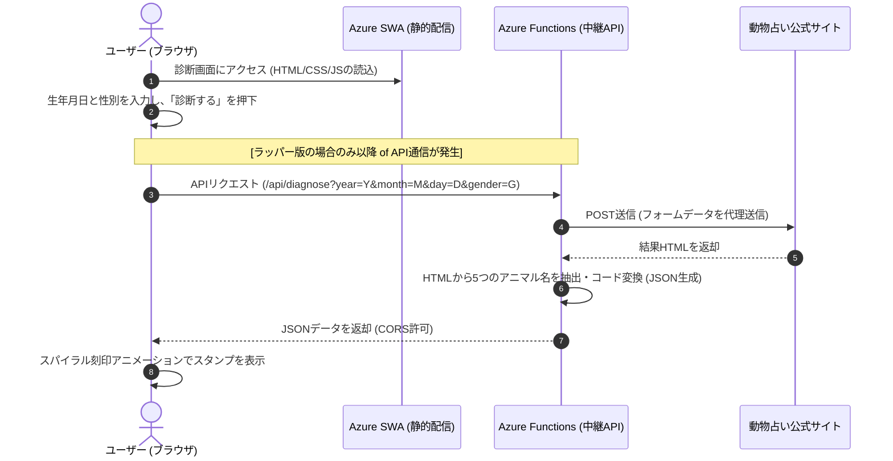

# コミュニケーションコード診断システム 基本設計書

本書は、生年月日から個人の特性である「コミュニケーションコード」を算出・表示するWebアプリケーションの基本設計書です。

---

## 1. システム概要

### 1.1 目的
四柱推命および個性心理学（動物占い）の理論に基づき、個人の生まれ持った性格的特性を「コミュニケーションコード（3桁の数値）」として可視化し、自己分析や他者理解を促進するための軽量で直感的なWebツールを提供します。

### 1.2 構成タイプ
本システムは以下の3つの診断パターンを内包し、それぞれ独立したURLで動作します。
1. **本質診断 (1st)**: 平常時の根幹の性質（日柱）のみを素早く診断。
2. **多面分析・オフライン版 (1st-2nd-3rd)**: 「本質」「表面」「意思決定」の3つの性質をネットワークを介さずクライアント側で高速計算。
3. **多面分析・ラッパー版 (1st-2nd-3rd-wrapper)**: 「本質」「表面」「意思決定」「希望」「隠れ」の5つの性質を、外部の診断エンジンを活用して高精度に取得。

---

## 2. システム構成・アーキテクチャ

システムは、フロントエンドの静的ホスティングと、バックエンドのサーバーレス関数を一体化した **Azure Static Web Apps (SWA)** 上で稼働します。

### 2.1 アーキテクチャ図（データフロー）

### 2.2 技術スタック
* **フロントエンド**: HTML5, Vanilla CSS (CSS Grid/Flexbox), Vanilla JS (ES6)
* **バックエンド (ラッパー版 API)**: Node.js v18 (Azure Functions v4 Programming Model)
* **ホスティング環境**: Azure Static Web Apps (SWA)
* **デプロイパイプライン**: Bitbucket Pipelines

---

## 3. 機能一覧

| 機能ID | 機能名 | 提供URL | 処理形態 | 主な仕様・特徴 |
| :--- | :--- | :--- | :--- | :--- |
| **FN-01** | 本質診断 (1st) | `/1st/` | クライアント側（完全オフライン） | 日柱の十二運星から「本質」の3桁コードを算出し、落款風スタンプで表示。 |
| **FN-02** | 本質診断 (ラッパー版) | `/1st-wrapper/` | クライアント・サーバーハイブリッド | 外部の診断エンジンへ中継API経由でPOSTし、「本質」のみを1枚のスタンプで表示。 |
| **FN-03** | 多面分析 (1st-2nd-3rd) | `/1st-2nd-3rd/` | クライアント側（完全オフライン） | 節入り計算略算式を用いて、日柱・月柱・年柱から3つのコードを即座に計算。ディレイ演出あり。 |
| **FN-04** | 多面分析 (ラッパー版) | `/1st-2nd-3rd-wrapper/` | クライアント・サーバーハイブリッド | 外部の診断エンジンへ中継API経由でPOSTし、「本質・表面・意思決定・希望・隠れ」の5つのコードを取得。 |
| **API-01** | 診断中継API | `/api/diagnose` | サーバーレス (Azure Functions) | 外部の無料診断フォームへ代理POSTを行い、レスポンスHTMLから正規表現で診断結果をパースしてJSONで応答。 |

---

## 4. UI/UX設計・デザインシステム

### 4.1 デザインコンセプト
日本の伝統色や質感をベースにした「和モダン」テイスト。余分な装飾を削ぎ落とし、赤い落款（朱肉のスタンプ）が白〜和紙風の背景に美しく映える、シンプルかつ高級感のあるレイアウトです。

### 4.2 カラーパレット
* **メイン背景 (`--paper`, `--paper2`)**: `#f3ece0` 〜 `#ece2d2` （和紙のような温かみのある生成り色）
* **テキスト (`--ink`)**: `#211c17` （墨汁をイメージした黒）
* **サブテキスト (`--sub`)**: `#6f6557` （砂色に近い落ち着いたグレーブラウン）
* **スタンプ・メイン色 (`--vermilion`, `--vermilion-deep`)**: `#c0392b` 〜 `#9c2a1f` （高級感のある朱肉の赤）
* **境界線 (`--line`)**: `#cdbfa8` （上品な金砂色）

### 4.3 アニメーション（演出）
診断結果が単に表示されるのではなく、以下の動きを加えることで情緒的な価値（UX）を高めています。
* **スタッガー（時間差）ポップ効果**: 
  スタンプが左から右、あるいは中心から外側へ順番に「ポン、ポン」とディレイを伴って浮かび上がるアニメーション（`pop`）を適用。
* **スパイラル刻印（ラッパー版のみ）**:
  一番重要な「本質」スタンプを最初に表示し、続いて「表面」➔「意思決定」➔「希望」➔「隠れ」の順で時計回りに表示が波及するスパイラル演出。
